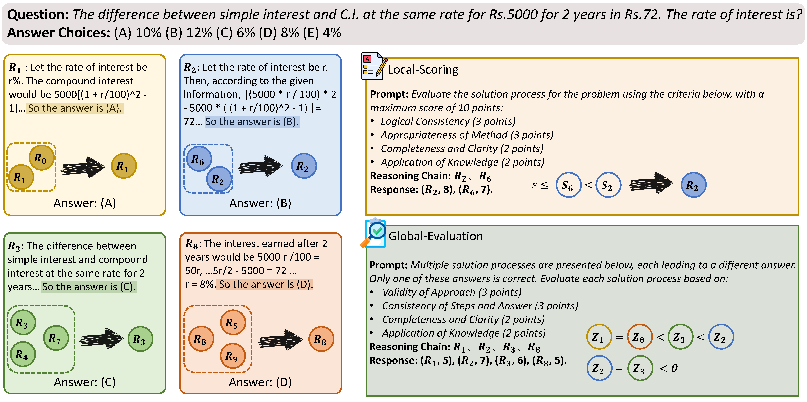

# Aggregation of Reasoning (AoR): A Hierarchical Framework for Enhancing Answer Selection in Large Language Models


LREC-COLING 2024: [Aggregation of Reasoning: A Hierarchical Framework for Enhancing Answer Selection in Large Language Models](https://aclanthology.org/2024.lrec-main.53/)


## Introduction 📝

This repository contains the code and data related to the paper "[Aggregation of Reasoning: A Hierarchical Framework for Enhancing Answer Selection in Large Language Models](https://arxiv.org/abs/2405.12939)". In this paper, we introduce **AoR (Aggregation of Reasoning)**, a hierarchical reasoning aggregation framework designed to enhance the reasoning capabilities of Large Language Models (LLMs) in complex tasks. Unlike traditional methods that rely on answer frequency from multiple reasoning chains, AoR evaluates reasoning chains themselves to select the most accurate answers. Additionally, AoR employs dynamic sampling to adjust the number of reasoning chains based on task complexity.




## Quick Links 🔗

- [Aggregation of Reasoning (AoR): A Hierarchical Framework for Enhancing Answer Selection in Large Language Models](#aggregation-of-reasoning-aor-a-hierarchical-framework-for-enhancing-answer-selection-in-large-language-models)
  - [Introduction 📝](#introduction-)
  - [Quick Links 🔗](#quick-links-)
  - [Requirements 📚](#requirements-)
  - [Data 💾](#data-)
  - [Quick Start 🚀](#quick-start-)
    - [Hyperparameters](#hyperparameters)
    - [Tips](#tips)
  - [Evaluation 💻](#evaluation-)
  - [Bug or Questions? 🤔](#bug-or-questions-)
  - [Citation 📖](#citation-)


## Requirements 📚

Please ensure you have the following requirements installed:
- `openai` >= 1.14.0
- `backoff`
- `tenacity`
- `jsonlines`
- `ipdb`


## Data 💾

Our dataset originates from [Large Language Models are Zero-Shot Reasoners](https://github.com/kojima-takeshi188/zero_shot_cot/tree/main/dataset), generously shared by Takeshi Kojima. We employ prompts from [Chain-of-Thought Prompting Elicits Reasoning in Large Language Models](https://arxiv.org/pdf/2201.11903.pdf) to guide models in generating initial reasoning processes.


## Quick Start 🚀

We provide a reference startup script in [main.py](code/main.py). Below is a comprehensive explanation of the arguments for launching the AoR script, allowing for customized runs.

To run the GSM8K dataset with AoR, use the following script:

```bash
python aor.py \
    --task GSM8K \
    --data-path aor_outputs/GSM8K_CoT_gpt-3.5-turbo-0301.jsonl \
    --record-path aor_records/GSM8K_AoR_log_gpt-3.5-turbo-0301.jsonl \
    --inference-model gpt-35-turbo-0301
```

You'll need to replace the paths with your own directories:

- `--data-path`: Path to your initial reasoning data in JSONL format.
- `--record-path`: Path where you want to save the output results.

### Hyperparameters

When running `aor.py`, you can customize AoR with the following input arguments:

- `--task`: The reasoning task AoR needs to complete, e.g., GSM8K, AQuA, CSQA.
- `--data-path`: The storage path for initial reasoning outcomes, in JSONL format, requiring `question`, `answer`, and `response_list` fields.
- `--record-path`: The storage location for output results.
- `--inference-model`: The model used for inference, default is `gpt-35-turbo-0301`.

**Hyperparameters:**

- `--initial-sample-size`: Initial sample size for reasoning chains.
- `--max-sample-size`: Upper limit for dynamic sampling of reasoning chains.
- `--batch-size`: Batch size for sampling reasoning chains.
- `--representative-count`: Representative count for the local scoring phase.
- `--scoring-threshold`: Threshold for scoring during the local scoring phase.
- `--termination-threshold`: Threshold for dynamic sampling termination.
- `--additional-sample-size`: Number of additional reasoning chains sampled in each iteration.

### Tips

1. **API Configuration:**
   - Please fill in your API keys in `code/inference.py`. Our code supports both OpenAI and Azure APIs. We recommend using the Azure API due to observed instability with the OpenAI API.

2. **Prompt Customization:**
   - In `code/prompt.py`, we provide general prompt templates for evaluation. We observed that evaluation criteria significantly affect model performance. We strongly recommend crafting specific evaluation rules for particular tasks to ensure reasonable and accurate assessments. Including appropriate demonstrations can help models better understand the evaluation criteria. You can add your custom prompts in `code/prompt.py` and specify them in the `prompt_dict` in `code/aor.py` corresponding to your desired task.

3. **Parsing Methods:**
   - We offer two parsing methods for evaluating reasoning chains: regular expression extraction and model-based automatic extraction. We found that regular expressions might not adapt well to the diverse outputs of large models. We recommend using the model-based automatic extraction method (`automated_parse_local_scoring_response` and `automated_parse_global_evaluation_response`). In our experiments, model-based parsing proved to be more stable. You can switch between methods based on your needs.

Happy researching and coding! 🚀


## Evaluation 💻

In [metric.py](code/metric.py), we provide evaluation methods for various tasks, utilizing accuracy to assess the model's reasoning performance. We offer the `process_pred` function for evaluating a single reasoning chain and the `process_pred_list` function for evaluating multiple reasoning chains.


## Bug or Questions? 🤔

If you have any suggestions or questions, feel free to reach out via email at [yinzhangyue@126.com](mailto:yinzhangyue@126.com). If you encounter any issues while using the code or find any bugs, please open a new issue on GitHub. We appreciate any constructive feedback that could help us improve. Thank you for your attention!


## Citation 📖

If you find our work useful, please cite our paper:

```bibtex
@inproceedings{yin-etal-2024-aggregation,
    title     = "Aggregation of Reasoning: A Hierarchical Framework for Enhancing Answer Selection in Large Language Models",
    author    = "Yin, Zhangyue  and
      Sun, Qiushi  and
      Guo, Qipeng  and
      Zeng, Zhiyuan  and
      Li, Xiaonan  and
      Sun, Tianxiang  and
      Chang, Cheng  and
      Cheng, Qinyuan  and
      Wang, Ding  and
      Mou, Xiaofeng  and
      Qiu, Xipeng  and
      Huang, Xuanjing",
    editor    = "Calzolari, Nicoletta  and
      Kan, Min-Yen  and
      Hoste, Veronique  and
      Lenci, Alessandro  and
      Sakti, Sakriani  and
      Xue, Nianwen",
    booktitle = "Proceedings of the 2024 Joint International Conference on Computational Linguistics, Language Resources and Evaluation (LREC-COLING 2024)",
    month     = may,
    year      = "2024",
    address   = "Torino, Italia",
    publisher = "ELRA and ICCL",
    url       = "https://aclanthology.org/2024.lrec-main.53",
    pages     = "609--625",
}
```

